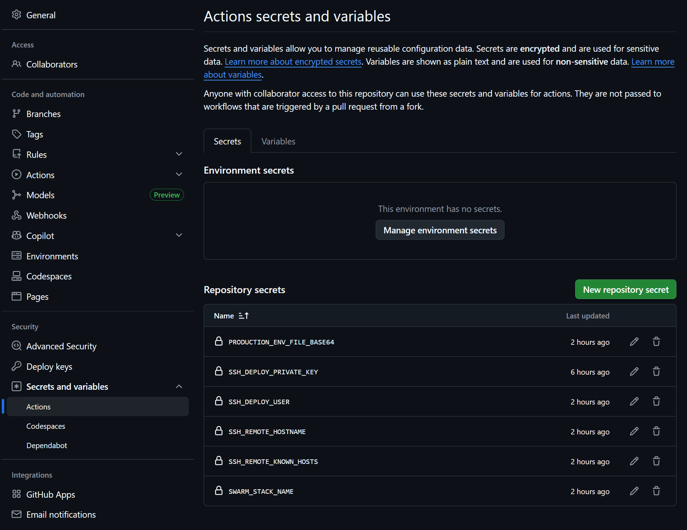

# Laravel Nuxt UI Starter Kit

[](https://laravel.com)
[](https://inertiajs.com)
[](https://vuejs.org)
[](https://ui.nuxt.com)

A production-ready Laravel starter kit built with **Inertia.js + Vue 3 + TypeScript + Nuxt UI**.

This Laravel starter kit is inspired by [laravel/vue-starter-kit](https://github.com/laravel/vue-starter-kit) and demonstrates how to use [Nuxt UI](https://ui.nuxt.com) in a [Laravel](https://laravel.com/) application using [Inertia.js](https://inertiajs.com/).

---

## Features

- Laravel 13 + PHP 8.3+
- Inertia.js v3
- Vue 3 with TypeScript (`strict: true`)
- Nuxt UI v4 components and theming
- Pre-configured server-side rendering
- End-to-end type safety between Laravel and TypeScript using `spatie/laravel-data` + `spatie/laravel-typescript-transformer`
- Type-safe Laravel route helper generated by TypeScript Transformer
- Vite dev/build pipeline with optional SSR build
- Laravel Fortify authentication flows:
  - login/logout
  - registration
  - forgot/password reset
  - email verification
  - two-factor authentication
- Built-in auth rate limiting (login + 2FA)
- Centralized, configurable error behavior (`config/errors.php`)
- Pest test suite with focused feature coverage
- PHPStan level 8 compliance

---

## UX Enhancements Included

### 1) Automatic Toast Error Handling (Inertia mutation requests)

Non-GET Inertia requests that fail return a structured JSON error payload, and the frontend automatically displays a Nuxt UI toast.

This gives users immediate feedback for failed form submits/actions without custom toast plumbing in every page.

### 2) Inertia Flash Alerts + Toasts

Redirect-based actions can set Inertia flash keys with explicit UI suffixes:

- `<color>_alert` will render an inline [Alert](https://ui.nuxt.com/docs/components/alert)
- `<color>_toast` will trigger a [Toast](https://ui.nuxt.com/docs/components/toast)


### 3) Friendly Error Pages + 419 Handling

- GET errors render a dedicated Inertia error page.
- 419 (expired page/session) redirects back with a warning flash message.
- Status-specific icon/detail/color can be configured in `config/errors.php`.

---

## Requirements

- PHP 8.3+
- Composer 2+
- Node.js 22+ (recommended)
- npm 10+
- SQLite/MySQL/PostgreSQL (tests default to in-memory SQLite)

---

## Quick Start

```bash
composer install
npm install
cp .env.example .env
php artisan key:generate
php artisan migrate
```

Start development (Laravel server, queue worker, logs, Vite in one command):

```bash
composer run dev
```

Open the app at the URL shown by `php artisan serve` (typically `http://127.0.0.1:8000`).

---

## Common Commands

### Development

```bash
composer run dev        # full local workflow
composer run dev:ssr    # full workflow with Inertia SSR server
npm run dev             # Vite only
```

### Build

```bash
npm run build
npm run build:ssr
```

### Code Quality

```bash
vendor/bin/pint --dirty # format changed PHP files
vendor/bin/pint         # format all PHP files
npm run lint            # eslint --fix
npm run typecheck       # vue-tsc --noEmit
php artisan typescript:transform # regenerate TS contracts + route helper
```

### Tests (Pest)

```bash
php artisan test
php artisan test --compact
```

Run a single test file:

```bash
php artisan test --compact tests/Feature/Auth/AuthenticationTest.php
```

Run a single test by name:

```bash
php artisan test --compact --filter="users can authenticate using the login screen"
```

Run one test case in one file:

```bash
php artisan test --compact tests/Feature/Settings/ProfileUpdateTest.php --filter="profile information can be updated"
```

## Type Contracts (PHP -> TS)

- Backend page/shared props are modeled with `Data` objects (for example `UserData`).
- Data classes annotated with `#[TypeScript]` are transformed into generated TypeScript contracts.
- Vue/Inertia props should consume generated types, including paginated props with `LengthAwarePaginator<T>` from `resources/js/types/pagination.d.ts`.

---

## How to Use Inertia Flash Data

From controllers, use `Inertia::flash(...)` with `<color>_alert` / `<color>_toast` keys:

```php
use Inertia\Inertia;

// Single key
return Inertia::flash('success_alert', 'Success - Resource created!')->back();

// Multiple keys
Inertia::flash([
    'success_toast' => 'Profile updated successfully.',
    'info_alert' => 'Next step: review your settings.',
]);

return to_route('profile.edit');
```

Behavior:

- Use available color prefixes that match the Nuxt UI theme system: `success`, `info`, `warning`, `error`, & `neutral`
- `*_alert` keys are displayed inline by `resources/js/components/FlashAlerts.vue`.
- `*_toast` keys are displayed by the global listener in `resources/js/composables/useInertiaRouterEvents.ts`.

---

## How to Trigger a Toast-Friendly Error

For non-GET Inertia requests, the global exception handler returns structured JSON toast metadata for HTTP exceptions. The frontend listens to Inertia `httpException` and `networkError` events and shows a toast automatically.

You can use normal Laravel exception/error flows (for example `abort(...)` or thrown exceptions):

```php
abort(404);
```

No per-form toast plumbing is required for uncaught mutation errors.

---

## Docker Swarm Deployment (Single VPS)

This project deploys with Docker Swarm using immutable images from GHCR.

Deployment is CI/CD-only:

- Image builds are handled by [serversideup/github-action-docker-build](https://github.com/serversideup/github-action-docker-build)
- Stack rollout is handled by [serversideup/github-action-docker-swarm-deploy](https://github.com/serversideup/github-action-docker-swarm-deploy)
- Laravel startup artisan commands are handled inside the app container by [Server Side Up Laravel Automations](https://serversideup.net/open-source/docker-php/docs/framework-guides/laravel/automations)
- No manual SSH deployment process is required

Deployment artifacts in this repo:

- `docker-compose-swarm.yml` (Swarm service definition)
- `.github/workflows/ci.yml` (lint, static analysis, tests, frontend build)
- `.github/workflows/cd.yml` (image build and Swarm deployment)

### Deployment model

- CD builds and pushes image `ghcr.io/<owner>/<repo>:<git-sha>`
- CD deploys the stack through the Server Side Up Swarm deploy action
- The deploy action runs `docker stack deploy --detach=false`, so the workflow waits for the service update before moving on
- The app container uses Server Side Up Laravel Automations for migrations, storage symlink creation, and optimizations during startup
- The `ssr-release` image extends `release` and adds the SSR runtime plus `inertia:start-ssr`
- SSR-specific s6 services are only copied into `ssr-release`, so the plain `release` target does not start the Inertia Node.js SSR process
- The stack is configured for a single always-on app replica, with `start-first` updates creating temporary overlap during deploys
- The server does not need a checked-out app repository for automated deployments

### 1) VPS prerequisites

Assumptions:

- Docker Engine is installed
- Your DNS `A` record for the app domain points to the VPS
- Ports `22`, `80`, and `443` are open

Initialize Swarm (once):

```bash
docker swarm init
```

### 2) Deploy Traefik (once)

Use [this stack](https://github.com/connorabbas/traefik-docker-compose/blob/master/docker-compose-swarm.yml) as your base.

On the VPS:

```bash
# Example deploy (use docker secrets instead of .env var export if desired)
set -a && source .env && set +a
docker stack deploy -c docker-compose-swarm.yml traefik
```

Verify:

```bash
docker service ls
docker service ps traefik_traefik
```

### 3) Create the deploy user on the VPS

For this CI/CD flow, GitHub Actions is the SSH client.

- `SSH_DEPLOY_PRIVATE_KEY` stores the private key in GitHub Actions
- the matching public key is added to `/home/deploy/.ssh/authorized_keys` on the VPS
- the `deploy` user must be able to run Docker commands without `sudo`

Use either `root` or an existing sudo-enabled user to connect to the VPS first:

```bash
ssh root@<server-ip>
```

Create the `deploy` user and allow it to talk to Docker:

```bash
sudo adduser --disabled-password --gecos "" deploy
sudo usermod -aG docker deploy
```

Create the SSH directory with the correct ownership and permissions:

```bash
sudo install -d -m 700 -o deploy -g deploy /home/deploy/.ssh
sudo touch /home/deploy/.ssh/authorized_keys
sudo chown deploy:deploy /home/deploy/.ssh/authorized_keys
sudo chmod 600 /home/deploy/.ssh/authorized_keys
```

Why this matters:

- `700` on `.ssh` keeps the directory private to the `deploy` user
- `600` on `authorized_keys` prevents SSH from rejecting the file as insecure
- Docker group access lets GitHub Actions run `docker stack deploy` remotely

### 4) Generate the SSH keypair on your local machine

Generate a dedicated deploy key locally so the private key never lives on the VPS:

```bash
ssh-keygen -t ed25519 -f ~/.ssh/id_ed25519_swarm_deploy -C "deploy"
```

This creates:

- private key: `~/.ssh/id_ed25519_swarm_deploy`
- public key: `~/.ssh/id_ed25519_swarm_deploy.pub`

### 5) Install the public key on the VPS

From your local machine, print your public key so you can copy it:

```bash
cat ~/.ssh/id_ed25519_swarm_deploy.pub
```

SSH into the VPS as `root` or an existing sudo-enabled user:

```bash
ssh root@<server-ip>
# or
ssh <sudo-user>@<server-ip>
```

On the VPS, open the deploy user's authorized keys file:

```bash
sudo nano /home/deploy/.ssh/authorized_keys
```

Paste the public key as a single line, then save and exit.

Ensure ownership and permissions are correct:

```bash
sudo chown deploy:deploy /home/deploy/.ssh/authorized_keys
sudo chmod 600 /home/deploy/.ssh/authorized_keys
```

Verify that SSH login works with the new key:

```bash
ssh -i ~/.ssh/id_ed25519_swarm_deploy deploy@<server-ip>
```

Once logged in as `deploy`, verify Docker access works without `sudo`:

```bash
docker info --format '{{.Swarm.LocalNodeState}}'
docker ps
exit
```

You can also test both SSH and Docker in one command from your local machine:

```bash
ssh -i ~/.ssh/id_ed25519_swarm_deploy deploy@<server-ip> "docker info --format '{{.Swarm.LocalNodeState}}'"
```

Expected output after `docker info` is usually `active` if Swarm is initialized.

If SSH works but Docker fails with a permissions error, log out and back in again so the new group membership is applied:

```bash
ssh -i ~/.ssh/id_ed25519_swarm_deploy deploy@<server-ip>
```

### 6) Prepare GitHub Actions secrets

Required secrets:

- `SWARM_STACK_NAME` (example: `laravel-nuxtui`)
- `SSH_DEPLOY_PRIVATE_KEY` (contents of `~/.ssh/id_ed25519_swarm_deploy`)
- `SSH_DEPLOY_USER` (example: `deploy`)
- `SSH_REMOTE_HOSTNAME` (domain or IP)
- `SSH_REMOTE_KNOWN_HOSTS`
- `PRODUCTION_ENV_FILE_BASE64`

Example reference (`/settings/secrets/actions` page within your repository):  


Suggested secret values:

- `SSH_DEPLOY_PRIVATE_KEY`: contents of `~/.ssh/id_ed25519_swarm_deploy`
- `SSH_DEPLOY_USER`: `deploy` (created in previous step)
- `SSH_REMOTE_HOSTNAME`: your server IP or hostname

Copy the private key to your clipboard:

```bash
cat ~/.ssh/id_ed25519_swarm_deploy
```

Then paste the full contents, including the `BEGIN` and `END` lines, into the `SSH_DEPLOY_PRIVATE_KEY` GitHub secret.

Generate `SSH_REMOTE_KNOWN_HOSTS` from your local machine:

```bash
ssh-keyscan -p 22 -H <server-hostname-or-ip> 2>/dev/null | sort -u
```

Copy that output into the `SSH_REMOTE_KNOWN_HOSTS` GitHub secret.

`SSH_REMOTE_KNOWN_HOSTS` lets CI verify it is connecting to your real server (host key pinning), not an impostor.

Common setup issues:

- `Permission denied (publickey)`: the public key was not added correctly, or `/home/deploy/.ssh` permissions are too open
- `Got permission denied while trying to connect to the Docker daemon socket`: the `deploy` user is not in the `docker` group yet, or you need to log out and back in
- host key verification errors: regenerate `SSH_REMOTE_KNOWN_HOSTS` with `ssh-keyscan` and update the GitHub secret

### 7) Build production env file locally

Create `.env.production` on your local machine (never commit it).

It should include your production app/runtime settings such as:

- `APP_ENV=production`
- `APP_DEBUG=false`
- `APP_DOMAIN=example.com`
- `APP_URL=https://example.com`
- `APP_KEY=...`
- `DB_*`, mail, queue/cache/session settings, etc.

Base64 encode it for GitHub secret `PRODUCTION_ENV_FILE_BASE64`:

```bash
# macOS
base64 < .env.production | pbcopy

# Linux (single-line output)
base64 -w 0 .env.production
```

### 8) What files must exist on the server?

For automated CI/CD in this setup: none from this app repository.

You only need:

- Docker + Swarm initialized
- Traefik stack running
- `traefik_proxy` overlay network
- SSH access for deploy user

The compose file runs from the GitHub runner, while Laravel startup commands run inside the app container on the server.

### 9) Automated deployment flow

After a pull request is merged into `main` or `master`:

1. CI has already run tests, lint, type checks, static analysis, and frontend build on the PR
2. CD uses [serversideup/github-action-docker-build](https://github.com/serversideup/github-action-docker-build) to build and push images to GHCR (`:sha` and `:latest`)
3. CD uses [serversideup/github-action-docker-swarm-deploy](https://github.com/serversideup/github-action-docker-swarm-deploy) for remote `docker stack deploy`
4. CD decodes `PRODUCTION_ENV_FILE_BASE64` during deploy
5. New app tasks run Laravel Automations during startup before they become healthy

Use branch protection to require all CI checks before merging into `main` or `master`, so CD only runs for validated code.
CD is intentionally merge-driven in this setup (no manual `workflow_dispatch` trigger).

> [!IMPORTANT]
> When using `AUTORUN_LARAVEL_MIGRATION_ISOLATION=true` and `CACHE_STORE=database`, the database must already contain the cache tables (`cache` and `cache_locks`) before startup migrations run.
>
> On a brand-new database, isolation can fail with:
> `SQLSTATE[42P01]: Undefined table: relation "cache_locks" does not exist`
>
> Recommended bootstrap flow for first deploy:
> 1. Set `AUTORUN_LARAVEL_MIGRATION_ISOLATION=false`
> 2. Deploy once so Laravel creates migration + cache tables
> 3. Re-enable `AUTORUN_LARAVEL_MIGRATION_ISOLATION=true` for subsequent deploys
>
> Alternative: pre-create cache tables ahead of first deploy.

### 10) Safe vs dangerous database changes

This stack uses `start-first` rolling updates, so the previous app task and the new app task may overlap briefly during deployment.

That means your database schema must remain compatible with both the current release and the previous release during rollout.

Safe changes for the standard deployment flow:

- adding a new table
- adding a new nullable column
- adding a new column with a default value
- adding an index

Dangerous changes that should not be shipped as a single rolling deploy:

- dropping a column
- renaming a column
- changing a column type
- adding stricter constraints that old code cannot satisfy

### 11) Expand and Contract pattern

For dangerous schema changes, adopt the Expand and Contract pattern across multiple deployments.

Typical sequence:

1. Expand: add the new schema shape without removing the old one
2. Transition: deploy code that can work with both shapes and backfill data if needed
3. Contract: remove the old schema only after the older app version is no longer running anywhere

Example for renaming a column:

1. add the new column as nullable
2. write to both old and new columns while continuing to read from the old column
3. backfill existing rows
4. switch reads to the new column in a later deploy
5. drop the old column in a final cleanup deploy

Use the normal rolling deployment flow only for backward-compatible migrations. If a release includes a destructive schema change that cannot be made backward-compatible, plan a maintenance deployment instead.

`AUTORUN_LARAVEL_MIGRATION_ISOLATION=true` prevents multiple new tasks from running migrations at the same time, but it does not make destructive schema changes safe during old/new app overlap.

### 12) SSR process notes

- SSR is optional, you can target the standard `release` for the image build within `.github/workflows/cd.yml` instead of using the default `ssr-release`
- SSR is enabled in the app container using a longrun s6 overlay process (`php artisan inertia:start-ssr`)
- Container health checks validate both app readiness (`/up`) and SSR readiness (`php artisan inertia:check-ssr`)

### 13) Common operations

```bash
docker service ls
docker service ps <stack>_laravel --no-trunc
docker service logs -f <stack>_laravel
docker stack services <stack>
```

Notes:

- This stack uses `replicas: 1` with `start-first` updates and rollback on failure
- Zero-downtime depends on the VPS having enough spare capacity to briefly run both the old and new app task during a deployment
- This gives deploy-time zero-downtime, but not the redundancy of multiple always-on replicas
- Do not use `php artisan down` in this deployment model
- `traefik_proxy` must exist as an overlay network

---
